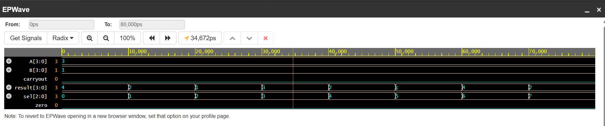

# 4-bit ALU in Verilog

## Description
A simple Verilog implementation of a 4-bit Arithmetic Logic Unit (ALU) that performs basic arithmetic and logic operations.

## Operations Supported
- Addition (A + B)
- Subtraction (A - B)
- Bitwise AND
- Bitwise OR
- Bitwise XOR
- Bitwise NOT (A)
- Increment A
- Decrement A

## Tools Used
- EDA Playground (online simulation)
- Icarus Verilog (local simulator)
- GTKWave (for waveform viewing)

## Files
- `alu.v` — ALU module
- `alu_tb.v` — Testbench with VCD dump
- `waveform.png` — waveform output image 

## 📈 Waveform Screenshot

## Usage
Run simulation using EDA Playground: [https://www.edaplayground.com/](https://www.edaplayground.com/)
